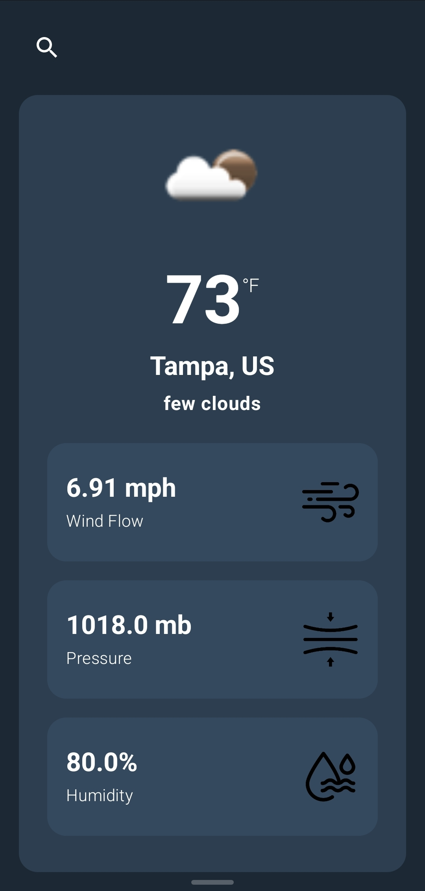

# WeatherApp

    
    
 This screenshot showcases the app's interface, providing a clear and vibrant view of the weather information.

## Introduction
A simple yet powerful Weather App where users can enter a city name and view real-time weather details like temperature, wind speed, pressure, and humidity. Built using MVVM, Clean Architecture, and Jetpack Compose for a modern and maintainable codebase.

## Features
- Built with Kotlin and Jetpack Compose for a responsive design
- Real-time weather data
- Location-based services

## License
This project is licensed under the MIT License - see the [LICENSE](LICENSE) file for details.
